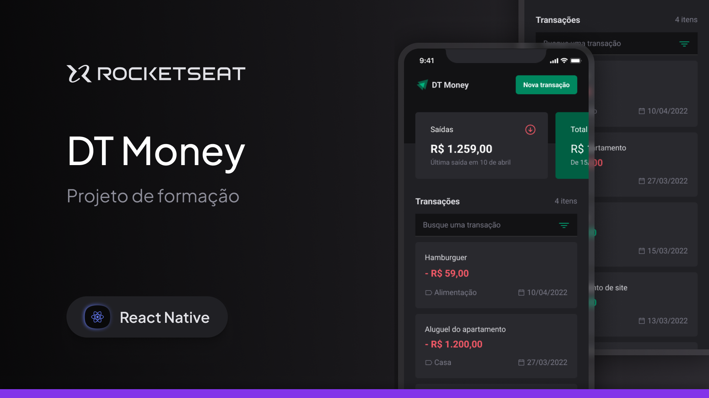
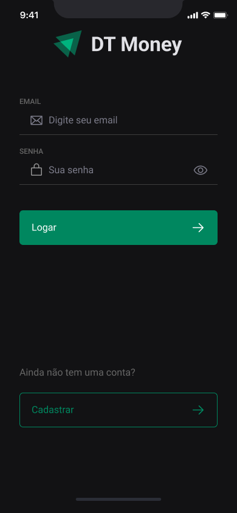
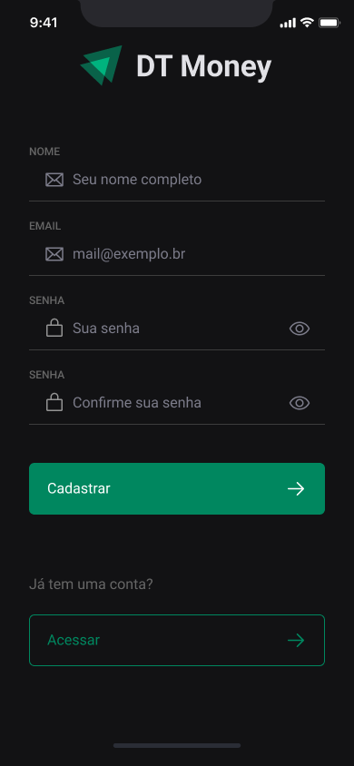
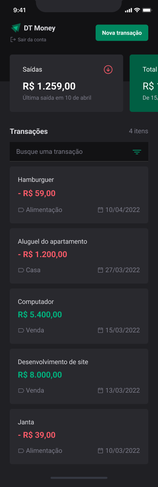
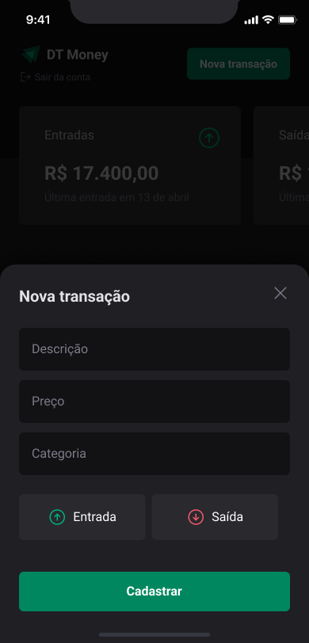
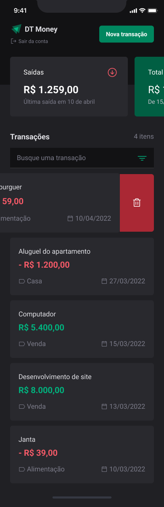
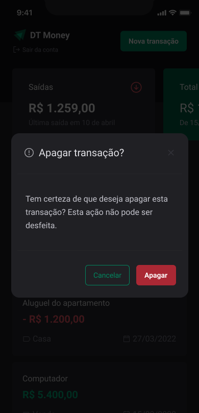
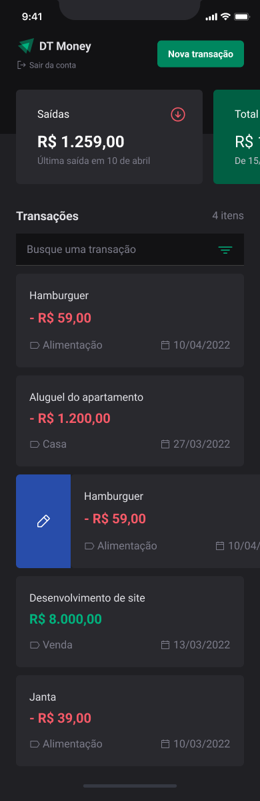
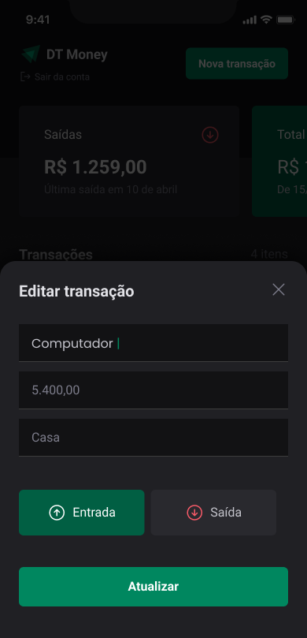
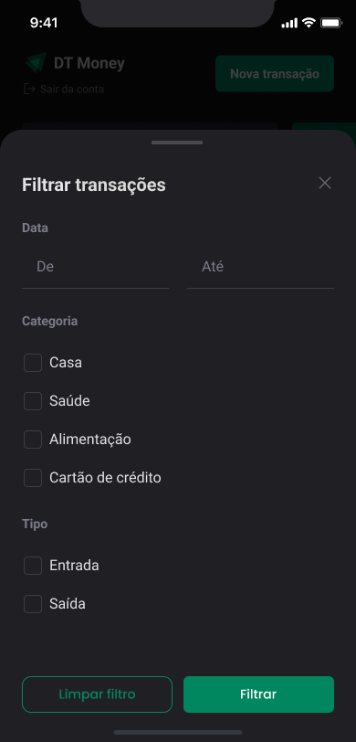

<h1 align="center">
  
</h1>

<p align="center">
  

  

  
  
  <a href="https://github.com/pabloxt14/dt-money-rn/commits/master">
    
  </a>
    
   

   <a href="https://github.com/pabloxt14/dt-money-rn/stargazers">
    
  </a>
</p>

<p>
  
</p>

<p align="center">
 <a href="#-about">About</a> | 
 <a href="#-layout">Layout</a> | 
 <a href="#-setup">Setup</a> | 
 <a href="#-technologies">Technologies</a> | 
 <a href="#-license">License</a>
</p>


## 💻 About

Esta aplicação de nome **DT Money** consiste basicamente em um aplicativo mobile de gerenciamento de finanças pessoais, que permite o cadastro, edição e exclusão de transações, classificação de transações por categorias e tipos de transações (entrada ou saída), além de apresentação de um resumo das transações (entradas, saídas e total).

Os principais conhecimentos aplicados nesta aplicação foram:
- Consumo de `APIs` no React Native;
- Utilização do `Context API` para gerenciamento de estados globais na aplicação;
- Utilização do `NativeWind`(biblioteca de estilização baseada no TailwindCSS) para estilização de componentes;

<!-- ## 🔗 Deploy

O deploy da aplicação pode ser acessada através da seguinte URL base: https://pabloxt14-nlw-expert-notes.vercel.app/ -->


## 🎨 Layout

Você pode visualizar o layout do projeto através [desse link](https://www.figma.com/community/file/1529159456475378262/dt-money-responsivo). É necessário ter conta no [Figma](https://www.figma.com/) para acessá-lo.

A seguir, veja uma demonstração das principais telas da aplicação:

### Sign In

<p align="center">
  
</p>

### Sign Up

<p align="center">
  
</p>

### Home

<p align="center">
  
</p>

### New Transaction

<p align="center">
  
</p>

### Swipeable Delete

<p align="center">
  
</p>

### Delete Transaction

<p align="center">
  
</p>

### Swipeable Edit

<p align="center">
  
</p>

### Edit Transaction

<p align="center">
  
</p>

### Filter Transactions

<p align="center">
  
</p>


## ⚙ Setup

### 📝 Requisites

Antes de baixar o projeto você vai precisar ter instalado na sua máquina as seguintes ferramentas:

* [Git](https://git-scm.com)
* [NodeJS](https://nodejs.org/en/)
* [NPM](https://www.npmjs.com/) ou [Yarn](https://yarnpkg.com/)

Além disto é bom ter um editor para trabalhar com o código como [VSCode](https://code.visualstudio.com/)

### Cloning and Running

Passo a passo para clonar e executar a aplicação na sua máquina:

```bash
# Clone este repositório
$ git clone git@github.com:pabloxt14/dt-money-rn.git

# Configure a API back-end
$ cd dt-money-rn/api
$ npm install # Instala as dependências
$ npm run dev # Executa a API back-end

# Acesse a pasta do projeto mobile no terminal
$ cd ../mobile

# Instale as dependências
$ npm install

# Em src/shared/api/dt-money.ts, altere a BASE_URL para a sua API back-end (de acordo com o endereço da sua máquina)
# Exemplo: BASE_URL = "http://192.168.2.123:3001"

# Execute a aplicação em modo de build de desenvolvimento
$ npx expo prebuild # Faz o build da aplicação (necessário para o expo run:android e expo run:ios)
$ npx expo run:android # Para Android
$ npx expo run:ios # Para iOS
```


## 🛠 Technologies

As seguintes principais ferramentas foram usadas na construção do projeto:

- **[React Native](https://reactnative.dev/)**
- **[Expo](https://expo.dev/)**
- **[TypeScript](https://www.typescriptlang.org/)**
- **[Nativewind](https://www.nativewind.dev/)**
- **[Expo Vector Icons](https://docs.expo.dev/guides/icons/)**
- **[Axios](https://axios-http.com/ptbr/docs/intro)**
- **[Bottom Sheet](https://github.com/gorhom/react-native-bottom-sheet)**
- **[Async Storage](https://docs.expo.dev/versions/latest/sdk/async-storage/)**
- **[React Hook Form](https://react-hook-form.com/)**
- **[Zod](https://zod.dev/)**
- **[Date Fns](https://date-fns.org/)**

> Para mais detalhes das dependências gerais da aplicação mobile veja o arquivo [package.json](./mobile/package.json)

> Para mais detalhes das dependências da API back-end veja o arquivo [package.json](./api/package.json)


## 📝 License

Este projeto está sob a licença MIT. Consulte o arquivo [LICENSE](./LICENSE) para mais informações

<p align="center">
  Feito com 💜 por Pablo Alan 👋🏽 <a href="https://www.linkedin.com/in/pabloalan/" target="_blank">Entre em contato!</a>  
</p>